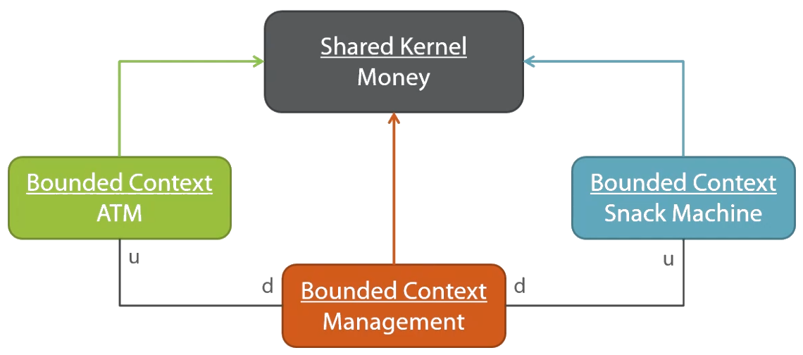

# Domain-Driven Design In Practice In Java

This is a Java - Spring Boot implementation of the project in [Domain-Driven Design in Practice Pluralsight course](https://www.pluralsight.com/courses/domain-driven-design-in-practice) by [Vladimir Khorikov](https://enterprisecraftsmanship.com/). The [original project](https://github.com/vkhorikov/DddInAction) was created in C# using .NET Framework. 

Aside from the DDD patterns, this course includes many other patterns, good practices and general guidelines regarding software architecture and design which are also followed in this project.

## Project Description

There are three bounded contexts which are separated by different folders under the same Java project. To describe their capabilities we use the terminology of the corresponding ubiquitous language:

1. Snack Machines:
    - Insert various coins or notes.
    - Select a snack.
    - Buy the snack.
    - Get change so that the machine keeps coins or notes of lowest denomination.
    - Return money back.
    - Get appropriate error messages and status updates of the money inside the machine and the money in transaction.
    - Load snacks in the machine.
    - Unload money from the machine.

2. ATMs:
    - Load money to the ATM.
    - Take money from the ATM by paying a small commission to the head office *(which is being "deposited" via domain events)*.

3. Management
    - Change the balance of the head office.
    - Unload cash from the Snack Machine.
    - Load cash to the ATM.

The project contains base classes for various tactical patterns of DDD:
 - Aggregate Root
 - Entity
 - Value Object
 - Domain Event

## Comparison

|             | Course Project    |             This project              |
|-------------|-------------------|---------------------------------------|
| Language    | C# 6              | Java 17                               |
| Framework   | .NET F 4.5.2      | Spring Boot 3.2.2 (Maven 3.9.5)       |
| DBMS        | MS SQL Server     | H2 (file-based)                       |
| ORM         | NHibernate        | Spring Data JPA with Hibernate        |
| DB Mappings | Fluent NHibernate | JPA ORM XML-based configuration       |
| Unit Tests  | Fluent Assertions | JUnit Jupiter with AssertJ assertions |

**Note:** 

We used **XML-based** (`.orm.xml` files) instead of **annotation-based configuration** to isolate our domain model from any persistence concerns (Onion Architecture), following the proposed guideline. We managed to almost completely isolate our domain model from any infrastructure concerns with only a few minor exceptions/compromises (as in the course) in the domain model:
 - Add protected no-argument constructors for entities so that Hibernate can use reflection to fill in the entities with the data from the database.
 - Add private no-argument constructors for value-objects.
 - Use `Hibernate.unproxy` static method in the base `Entity` class, because Hibernate creates proxy classes by inheriting from our entities, but we need to access the real entity classes when overriding their `equals` method.

**Note:** 

We omit the use of `Repository` base class which was introduced in the course as it does not seem necessary. 

**Note**

We use Java records for the DTO implementations rather than classes for faster implementation.